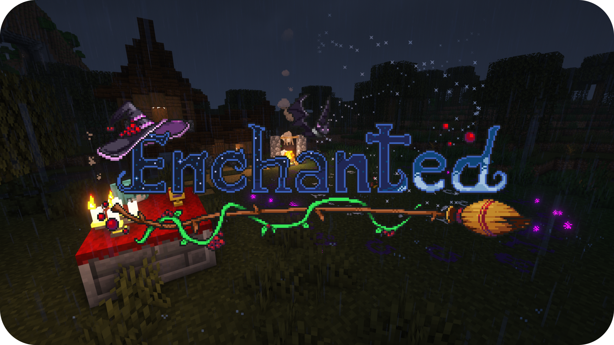
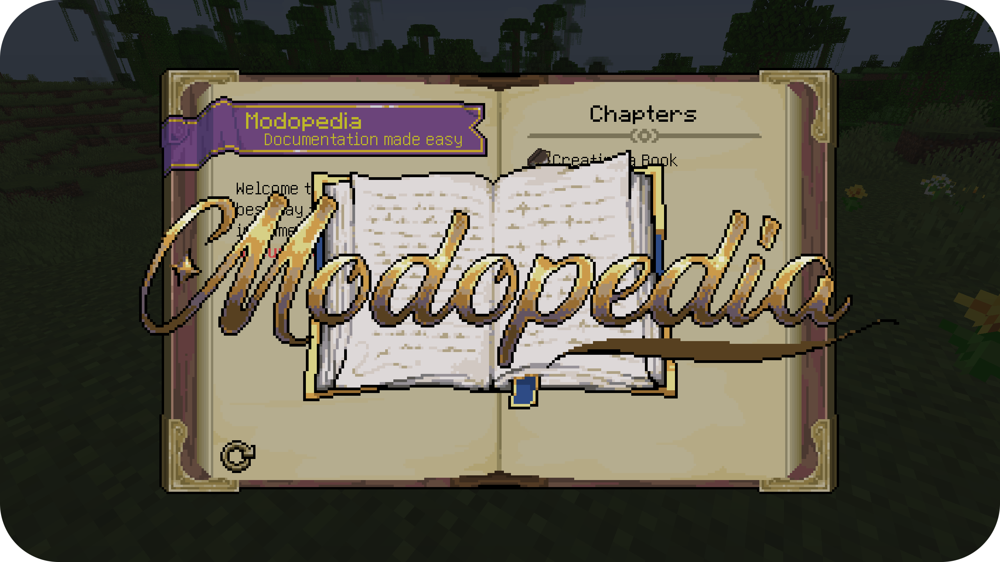

## 👋Introduction

Hi there! I'm Freddy, a freelance game developer and university student from the United Kingdom. I work on a large variety of projects from popular Minecraft mods with thousands of users to anti-cheat solutions, backends and even websites.

Feel free to reach out to me with questions about my work or particularly about modding!

## 📜Technical Skills

- **Languages**: Java, Go, C, C++, JavaScript, TypeScript, HTML5
- **Databases**: MySQL, Postgres, SQLite
- **Games/Engines**: Minecraft, Unreal Engine, Unity

## 💻Passion Projects

<table width="100%">
<tr>

<td width="50%" align="center">

A large, long running minecraft mod I've been developing since 2020 about witchcraft and magic, averaging about 6000 downloads per day with an active community.

</td>
<td width="50%" align="center">

Extensive library for creating dynamic user-generated guides and documentation in Minecraft. It is utilised in Enchanted and other modding projects as well.

</td>

</tr>
</table>
